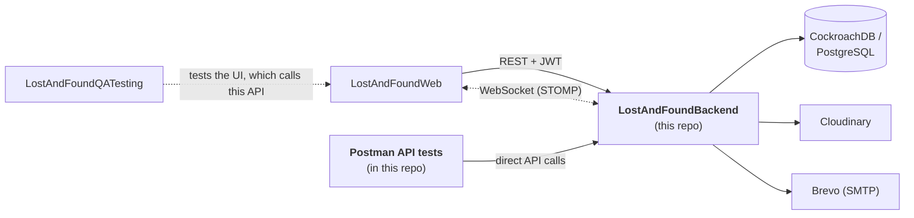

# 🧭 Lost & Found Nepal: Backend

The Spring Boot backend for **Lost & Found Nepal**. It handles authentication, lost/found item data, real-time updates, image storage and email notifications.

🌐 **Live site:** [lostandfoundnepal.pages.dev](https://lostandfoundnepal.pages.dev/)

> **A personal project.** I built this on my own to practise backend design and full-stack development. It isn't a commercial product and isn't affiliated with any organisation.


---

## 🔗 Part of a 3-repo project

| Repo | Role | |
|---|---|---|
| [LostAndFoundWeb](https://github.com/maheshzrawal333/LostAndFoundWeb) | React frontend | Consumes this API |
| **LostAndFoundBackend** | Spring Boot API, auth, database, images, email | 👈 *you are here* |
| [LostAndFoundQATesting](https://github.com/maheshzrawal333/LostAndFoundQATesting) | Selenium + TestNG end-to-end tests | UI-level tests of the app built on this API |



The [frontend](https://github.com/maheshzrawal333/LostAndFoundWeb) is the main client of this API. The Postman tests in this repo call the API directly, while the [QA suite](https://github.com/maheshzrawal333/LostAndFoundQATesting) exercises it indirectly by driving the frontend in a real browser.

## ✨ What it does

- 🔐 Registers and authenticates users with **JWT** (Spring Security)
- 📝 Stores and serves **lost** and **found** item reports
- 🙋 Handles **claims** on found items
- 🖼️ Uploads item photos to **Cloudinary**
- ⚡ Pushes live updates to clients over **WebSocket**
- 📧 Sends email notifications through **Spring Mail** (Brevo SMTP)
- ✅ Validates incoming requests with Bean Validation
- 📜 Logs with **Logback**
- 🧪 Ships with **Postman** collections for automated API testing

## 🧰 Tech stack

| Area | Tools |
|---|---|
| Language / runtime | Java 21 (the Docker image builds with JDK 23) |
| Framework | Spring Boot 4.1 (Web MVC, Security, Validation, WebSocket, Mail) |
| Persistence | Spring Data JPA / Hibernate |
| Database | PostgreSQL driver, used with CockroachDB in the cloud; H2 for local/dev |
| Auth | JWT via JJWT 0.12.3 |
| Media | Cloudinary (`cloudinary-http5` 2.0.0) |
| Email | Spring Boot Mail with Brevo |
| Logging | Logback |
| Tooling | Maven (wrapper included), Lombok, Docker |
| API testing | Postman (collections and environments) |

## 🚀 Getting started

**Requirements:** JDK 21+ (Maven is optional, since the wrapper is included).

```bash
git clone https://github.com/maheshzrawal333/LostAndFoundBackend.git
cd LostAndFoundBackend
./mvnw spring-boot:run          # Windows: mvnw.cmd spring-boot:run
```

Then start the [frontend](https://github.com/maheshzrawal333/LostAndFoundWeb) and point it at this server.

### ⚙️ Configuration

Provide these through `application.properties` or environment variables, whichever this project uses. **Never commit real secrets.**

| Setting | Purpose |
|---|---|
| Database URL, username, password | PostgreSQL or CockroachDB (H2 works for quick local runs) |
| JWT secret and expiry | Signing and validating auth tokens |
| Cloudinary cloud name, key, secret | Storing uploaded photos |
| Mail host, port, username, password | Brevo SMTP for notification emails |
| Allowed frontend origin (CORS) | Lets the web app call this API, for example `http://localhost:5173` during development |

### 🐳 Run with Docker

```bash
docker build -t lost-and-found-backend .
docker run -p 10000:10000 --env-file .env lost-and-found-backend
```

The Dockerfile is a two-stage build. Maven compiles the app, then a slim JRE image runs it. It exposes port `10000` and caps JVM memory (`-Xmx256m`) so it fits on small free-tier hosts.

## 🧪 Testing

The project is tested at more than one level:

| Level | Tool | Where |
|---|---|---|
| **API automation** | Postman | This repo (see below) |
| Unit / integration | Spring Boot test support (`./mvnw test`) | `src/test` |
| End-to-end (UI) | Selenium + TestNG | [LostAndFoundQATesting](https://github.com/maheshzrawal333/LostAndFoundQATesting) |

### 📮 Postman API automation

The API is covered by **Postman** collections that call the endpoints directly, with no browser or frontend involved. That makes them a quick way to check that the API behaves correctly, and they can be re-run after every change.

**Run in the Postman app**

1. Import the collection (and environment file, if there is one) from this repo.
2. Set the environment variables, such as the base URL and any test account details.
3. Open the **Collection Runner** and run the collection.

**Run from the command line with Newman**

```bash
npm install -g newman
newman run <path-to-collection>.json -e <path-to-environment>.json
```

Replace the paths with the collection and environment files in this repo.

Tips:

- Use `http://localhost:<port>` as the base URL for a local backend, or the deployed URL to check production.
- Keep real credentials and secrets out of exported environment files.
- Run the Postman suite before the UI tests. If both fail, the problem is most likely in the API. If only the UI tests fail, look at the [frontend](https://github.com/maheshzrawal333/LostAndFoundWeb).

### 🖥️ End-to-end UI tests

Whole-app coverage lives in
[**LostAndFoundQATesting**](https://github.com/maheshzrawal333/LostAndFoundQATesting). If you change an API's behaviour, re-run the Postman tests first, then the UI tests against a running frontend and backend.

## ☁️ Deployment

| Part | Where |
|---|---|
| Backend | Docker container on Render |
| Database | CockroachDB |
| Images | Cloudinary |
| Email | Brevo |
| Frontend | Cloudflare Pages ([repo](https://github.com/maheshzrawal333/LostAndFoundWeb)) |

> ⏳ On free-tier hosting, the first request after a period of inactivity may take a while while the container wakes up.

## 📁 Repository layout

```
LostAndFoundBackend/
├── .mvn/wrapper/     # Maven wrapper
├── logs/             # Log output
├── src/              # Application source and tests
├── Dockerfile        # Two-stage build for deployment
├── mvnw, mvnw.cmd    # Maven wrapper scripts
└── pom.xml
```

## 📄 License & usage

Personal project with no open-source license applied yet. You're welcome to read the code and learn from it. If you'd like to reuse any of it, please get in touch first.

## 👤 Author

Built by **[@maheshzrawal333](https://github.com/maheshzrawal333)**. Issues and ideas are welcome.
